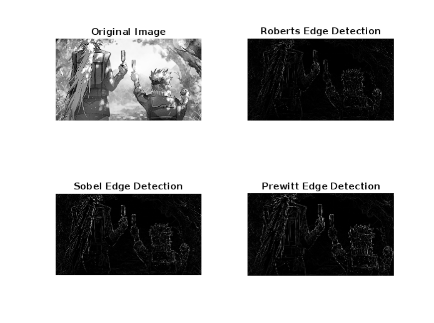
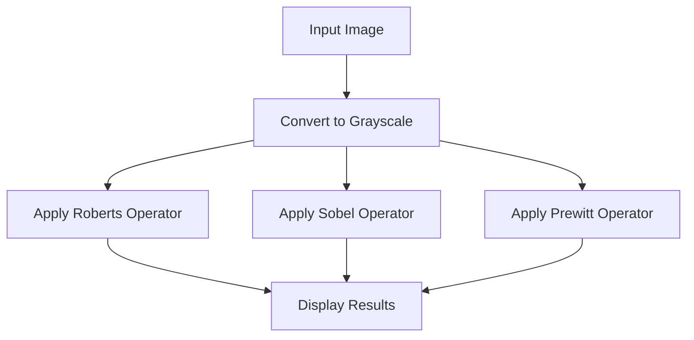

# Edge Detection using Roberts, Sobel, and Prewitt Operators in MATLAB

## Guided By
- Dr. Tapan Jain

## Introduction
This MATLAB script performs edge detection using three first-order derivative methods: **Roberts, Sobel, and Prewitt operators**. It reads an image (`image.jpg`), converts it to grayscale (if necessary), applies the respective filters, and visualizes the results.

## How to Run the Script
1. Place `image.jpg` in the same directory as the script.
2. Open MATLAB and navigate to the directory containing the script.
3. Run the script by typing:
   ```matlab
   edge_detection
   ```
4. The script will display the original grayscale image along with the results of **Roberts, Sobel, and Prewitt** edge detection methods.

## Explanation of Methods
### 1. Roberts Cross Operator
The Roberts operator computes gradients using 2×2 convolution kernels:
   
   ```
   Gx = [1  0;
         0 -1];
   Gy = [0  1;
        -1  0];
   ```
   
### 2. Sobel Operator
The Sobel operator uses 3×3 kernels that give more weight to central differences:
   
   ```
   Gx = [-1  0  1;
         -2  0  2;
         -1  0  1];
   Gy = [-1 -2 -1;
          0  0  0;
          1  2  1];
   ```
   
### 3. Prewitt Operator
Similar to Sobel but with equal weight to all differences:
   
   ```
   Gx = [-1  0  1;
         -1  0  1;
         -1  0  1];
   Gy = [-1 -1 -1;
          0  0  0;
          1  1  1];
   ```

## Input and Output
- **Input Image**:  
  

- **Output Visualization**:  
  

## Comparison Table
| Operator   | Kernel Size | Sensitivity to Noise | Edge Thickness | Computational Cost |
|------------|-------------|-----------------------|----------------|--------------------|
| Roberts    | 2×2         | High                 | Thin           | Low                |
| Sobel      | 3×3         | Moderate             | Medium         | Moderate           |
| Prewitt    | 3×3         | Moderate             | Medium         | Moderate           |

## Workflow Diagram


## Presented By
- Vedant Shrivastava (BT22ECI004)
- Ayush Ambatkar (BT22ECI005)
- Darshan Tate (BT22ECI011)

## License
This script is open for educational use and modification.

